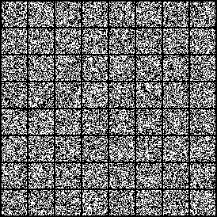
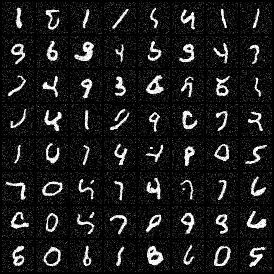
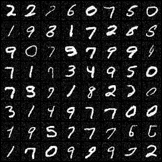

# UNet Convolutional Neural Network Implementation
- Generates MNIST images from random noise that mimic human handwriting
- A convolutional neural network that compresses and uncompresses image features
- The encoder or left half compresses images into their abstract latent features
- The decoder or right half reconstructs details that form a segmentation map
- Skip connections are present between layers to feed forward small details that may be lost in compression
- Implementation present in the file `networks.py`

# MNIST Image Comparison Showcase

  
   
  <em>Without UNet Implementation Output</em>

  
   
  <em>UNet Version 1 Output</em>

  
   
  <em>UNet Final Version Output</em>

We can see that on average, the final implementation of the UNet provides the most realistic looking versions of MNIST digits, and suffers the least artifacts.

# CS 444: Deep Learning for Computer Vision, Fall 2024, Assignment 5

Assignment is due at 11:59:59 PM on Thursday Dec 5 2024.

All instructions are included in `generative.ipynb`.

Change Log:
- Nov 16: Improved logging and display of images for Q3. Added more
  instructions for Q3 in the notebook file.
